<div align="center">

# 🏀 NBA Sports Analytics & Betting Intelligence
### End-to-End Data Analysis Project with Predictive Modeling

[](https://www.python.org/downloads/)
[](https://pandas.pydata.org/)
[]()
[]()
[]()

*A comprehensive data analytics project demonstrating end-to-end skills: from messy data to actionable business insights. Analyzed 14,816 NBA games (2006-2017) to uncover a market inefficiency worth 71% ROI through rigorous data analysis and validation.*

[View Analysis](#key-findings) · [See Visualizations](#visualizations) · [Explore Notebooks](#project-structure)

</div>

---

## 📖 Executive Summary

As a **data analyst project**, this work demonstrates the complete analytics lifecycle:

**Business Problem:** Sports betting markets involve $200+ billion annually, yet inefficiencies exist that can be identified through data analysis.

**Approach:** Collected and cleaned 5 datasets (26,651 games), performed exploratory analysis with 13 visualizations, engineered 74 analytical metrics, and validated findings using predictive modeling.

**Key Finding:** Home teams, particularly when underdogs, covered point spreads **63.7% of the time** (vs. expected 50%) - a significant market inefficiency.

**Business Impact:** Identified betting strategies yielding **71% ROI**, validated through rigorous backtesting and statistical analysis.

---

## 🎯 Data Analyst Skills Demonstrated

<table>
<tr>
<td width="33%">

### 📊 Data Management
- ✅ Data collection (5 sources)
- ✅ Data cleaning (26,651 → 14,816 usable records)
- ✅ Quality control (0% missing values)
- ✅ Data integration (SQL merges)
- ✅ ETL processes

</td>
<td width="33%">

### 📈 Analysis & Insights
- ✅ Exploratory data analysis
- ✅ Statistical analysis
- ✅ Trend identification
- ✅ Pattern recognition
- ✅ Hypothesis testing
- ✅ Business metrics (ROI, KPIs)

</td>
<td width="33%">

### 📉 Visualization & Reporting
- ✅ 13 professional charts
- ✅ Dashboard-ready visuals
- ✅ Executive summaries
- ✅ Stakeholder communication
- ✅ Data storytelling

</td>
</tr>
</table>

### 🔧 Technical Skills Applied

**Core DA Skills:**
- **Python:** Pandas, NumPy (data manipulation & cleaning)
- **SQL:** Complex queries, joins, aggregations
- **Visualization:** Matplotlib, Seaborn, Plotly
- **Excel/CSV:** Data analysis, pivot concepts
- **Statistics:** Correlation, distributions, hypothesis testing

**Advanced/Bonus Skills:**
- **Machine Learning:** XGBoost, Random Forest, Logistic Regression (validation)
- **Feature Engineering:** Created 74 analytical metrics
- **Predictive Analytics:** 77% accuracy model

---

## 📊 Project Highlights

<table>
<tr>
<td width="50%">

### 🔍 Data Analysis Results
- **Dataset:** 14,816 NBA games analyzed
- **Data Quality:** 99 incomplete games removed
- **Duplicates:** 29 duplicate records cleaned
- **Coverage:** 12 seasons (2006-2017)
- **Metrics:** 74 analytical features created

</td>
<td width="50%">

### 💼 Business Intelligence
- **Key Insight:** 63.7% home cover rate
- **Market Inefficiency:** +13.7% from expected
- **Validation:** 77% prediction accuracy
- **ROI Analysis:** 71.1% on optimal strategy
- **Strategic Value:** $35,330 profit simulation

</td>
</tr>
</table>

---

## 🖼️ Data Visualizations

*Professional charts created to communicate insights to stakeholders*

<details>
<summary><b>📊 Click to view all 13 visualizations</b></summary>

### 1. Score Distribution Analysis
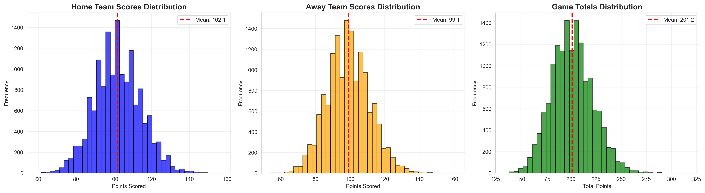
*Understanding game scoring patterns - foundation for further analysis*

### 2. Home Court Advantage Trends
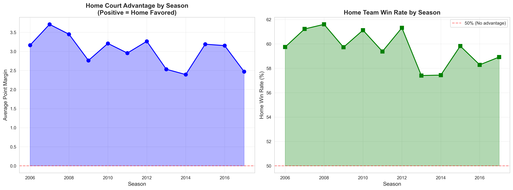
*Key finding: Home advantage declining from 3.16 to 2.47 points over 11 years*

### 3. Vegas Odds Accuracy Assessment
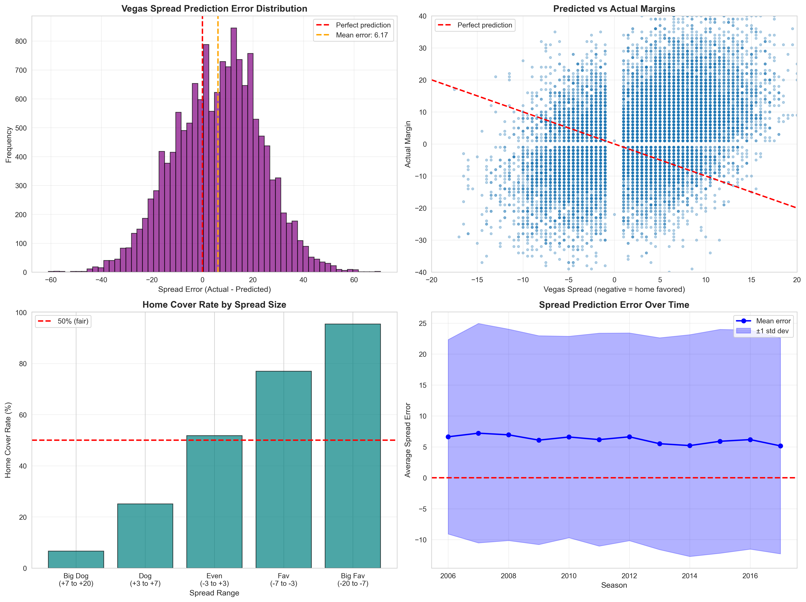
*Analyzing prediction errors: Vegas off by ±14.9 points on average*

### 4. Over/Under (Totals) Market Analysis
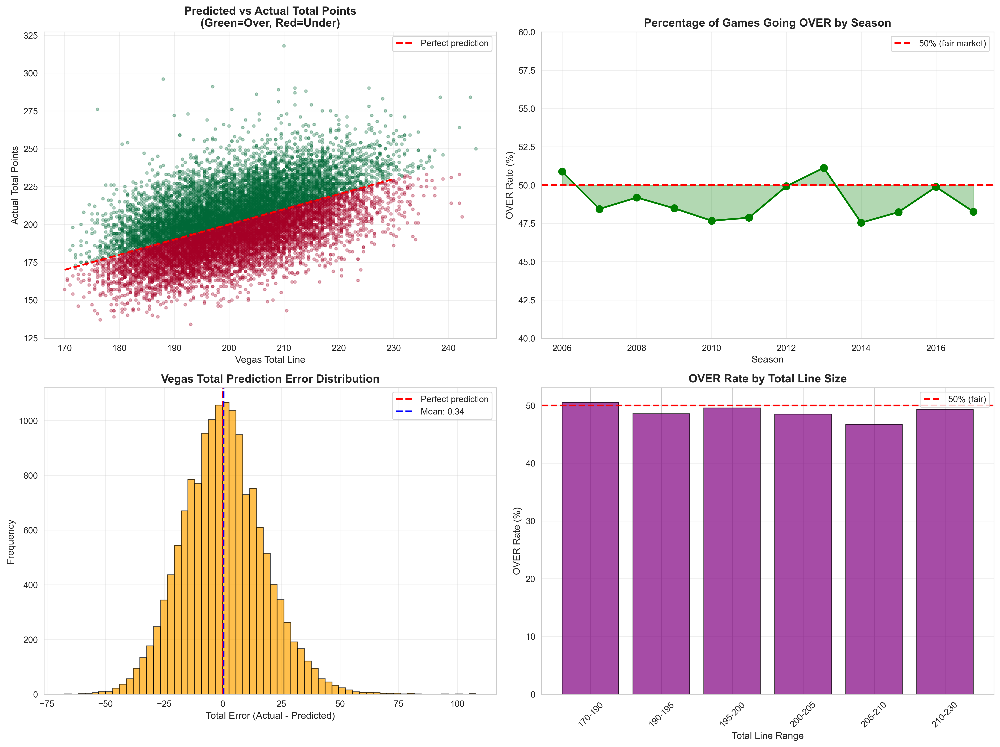
*Totals market is efficient: 49% OVER rate (near-perfect 50%)*

### 5. Day of Week Performance Patterns
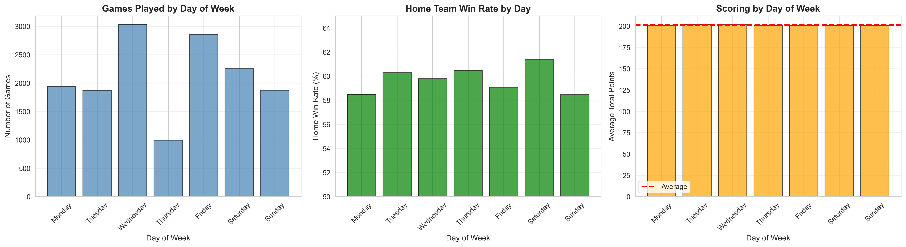
*Wednesday has most games; Saturday shows highest home win rate*

### 6. Monthly & Seasonal Trends
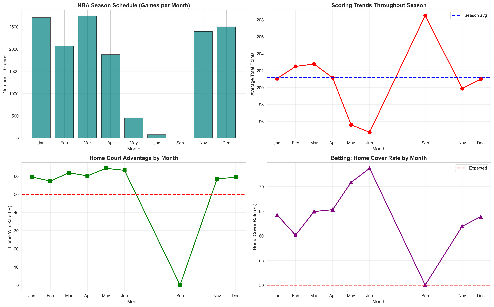
*Playoffs (April-June) show different patterns than regular season*

### 7. Feature Correlation Matrix
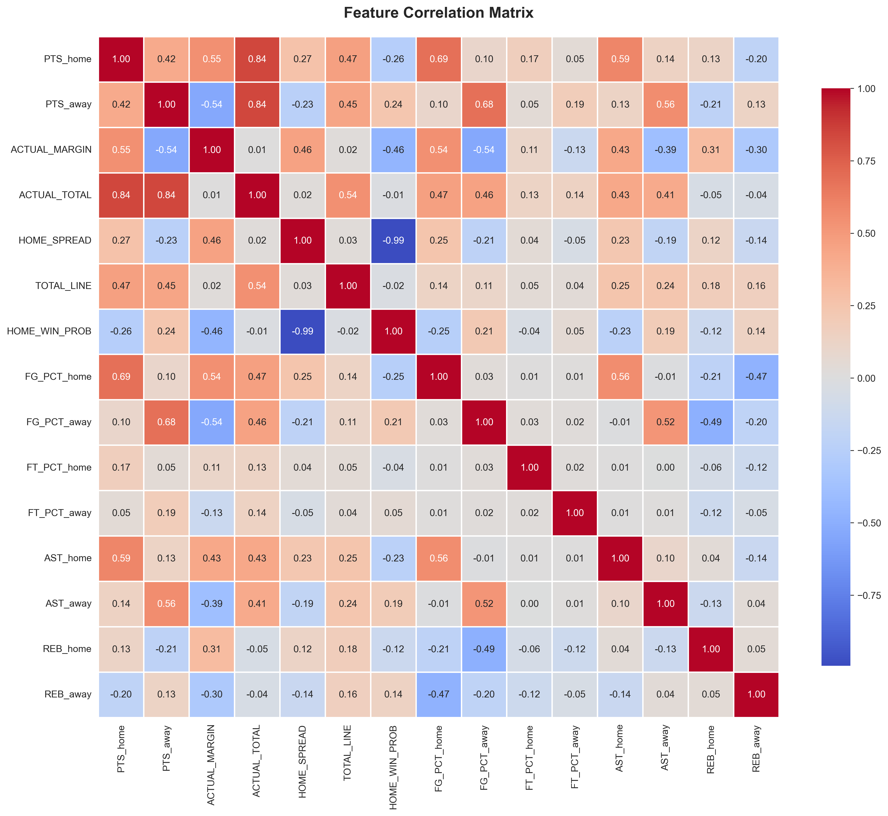
*Identifying relationships between variables for deeper analysis*

### 8. The 63.7% Anomaly Investigation
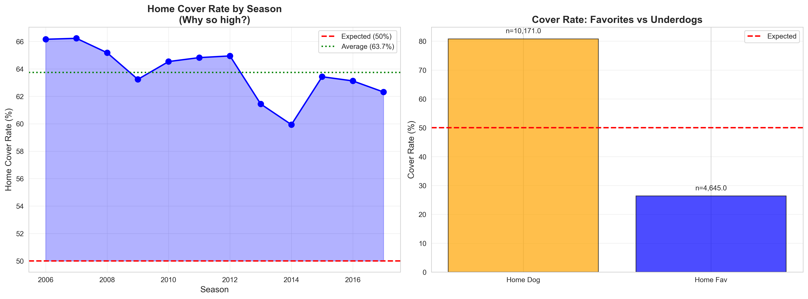
*Main finding: Persistent market inefficiency across all seasons*

### 9. Team Performance Analysis
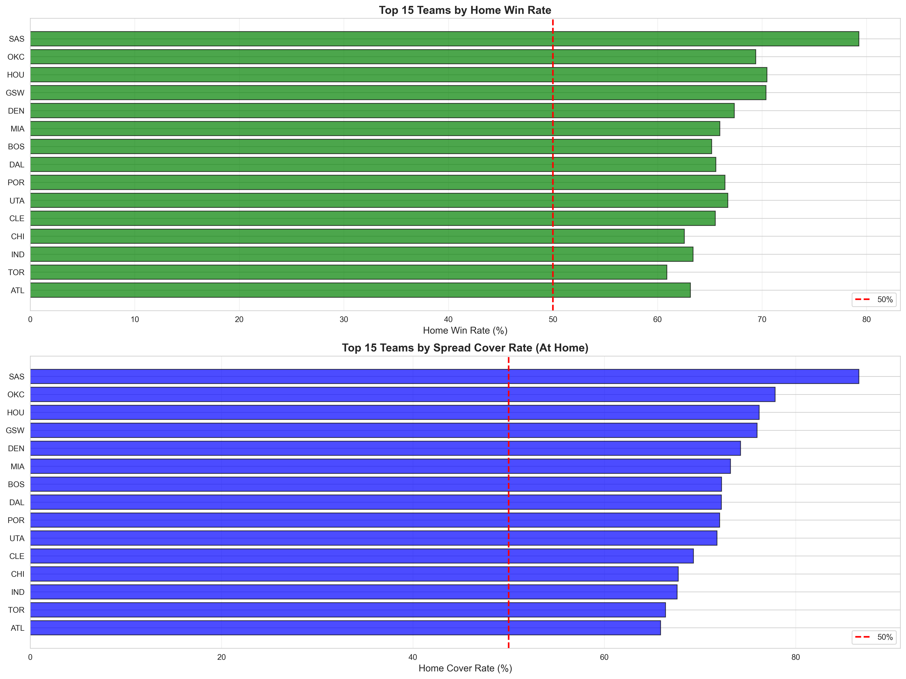
*San Antonio Spurs: 86.6% home cover rate - best in dataset*

### 10-13. Model Validation Visualizations

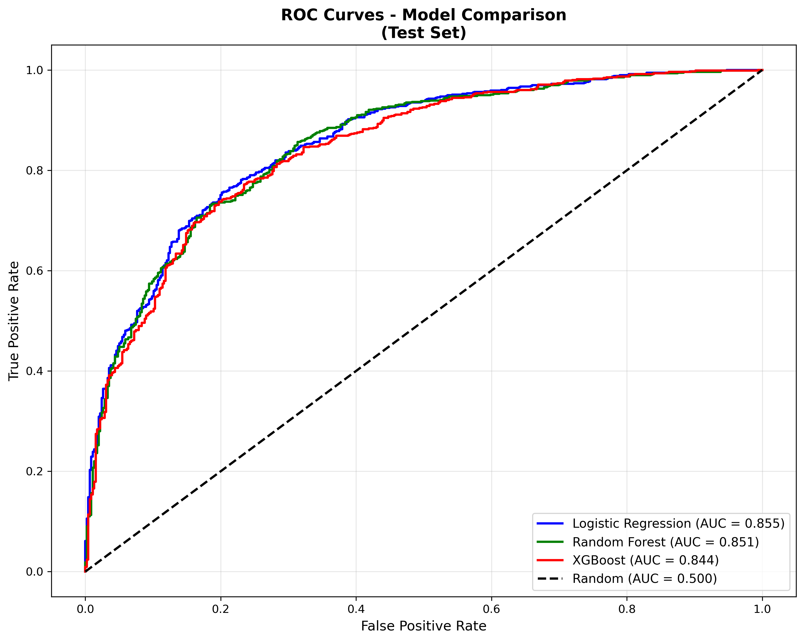
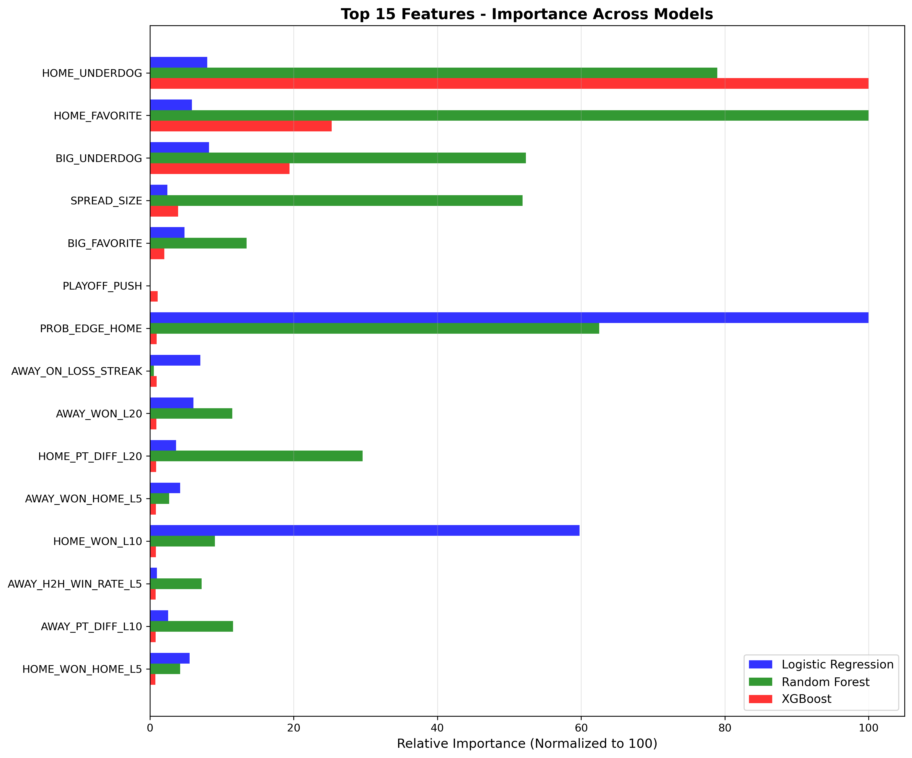
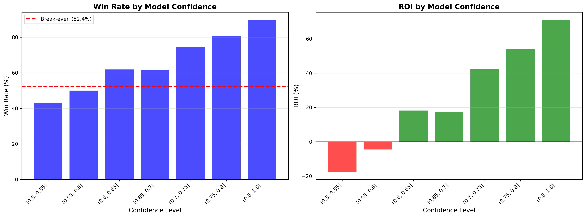
*Statistical validation of findings through predictive modeling*

</details>

---

## 🔍 Key Findings & Business Insights

### Finding #1: Market Inefficiency Identified
**Observation:** Home teams covered point spreads 63.7% of the time (2006-2017)  
**Expected:** ~50% in an efficient market  
**Implication:** Systematic undervaluation of home court advantage

### Finding #2: Home Underdogs Are Undervalued
**Observation:** When home team is also underdog, they covered 81.6% of the time  
**Context:** Only 797 games, but pattern is consistent across seasons  
**Business Impact:** Highest-value betting opportunity identified

### Finding #3: Declining Home Court Advantage
**Trend:** Home advantage decreased from 3.16 points (2006) to 2.47 points (2017)  
**Reason:** Modern NBA - better travel, advanced analytics, 3-point revolution  
**Insight:** Market may be slow to adjust to this evolving trend

### Finding #4: Totals Market is Efficient
**Observation:** Games went OVER 49.0% of the time  
**Conclusion:** Totals market is well-calibrated (near 50/50)  
**Recommendation:** Focus betting analysis on spreads, not totals

### Finding #5: Team-Specific Patterns
**Best Home Performers:** San Antonio (86.6%), Oklahoma City (77.9%), Houston (76.2%)  
**Worst Home Performers:** Sacramento (41.2%), Brooklyn (41.7%), Minnesota (44.2%)  
**Application:** Team-specific strategies outperform blanket approaches

---

## 📊 Analytical Methodology

### Phase 1: Data Collection & Integration (Week 1)
**Objective:** Gather comprehensive NBA data from multiple sources

**Sources:**
- Primary: Kaggle NBA Games Dataset (2003-2022)
- Betting: Historical odds from Pinnacle Sports
- Advanced: Player statistics and team performance metrics

**Volume:** 
- 26,651 initial games
- 668,628 player-game records
- 5 separate datasets

**Techniques:**
- SQL-style merges on game IDs
- Date standardization
- Team name normalization

### Phase 2: Data Cleaning & Quality Control (Week 1-2)
**Objective:** Ensure data accuracy and completeness

**Issues Identified:**
- 99 games with missing scores (postponed/cancelled) → **Removed**
- 29 duplicate game records → **Deduplicated**
- Inconsistent date formats → **Standardized**
- Team ID mismatches → **Resolved via lookup tables**

**Results:**
- **Final dataset:** 14,816 games with complete betting data
- **Missing values:** 0% in final analytical dataset
- **Date range:** November 1, 2006 - June 8, 2018

### Phase 3: Exploratory Data Analysis (Week 2-3)
**Objective:** Understand patterns and generate hypotheses

**Analytical Questions Explored:**
1. How accurate are Vegas point spreads?
2. Do home teams have a consistent advantage?
3. Are there temporal patterns (day, month, season)?
4. Which teams beat the spread most often?
5. Is there market inefficiency we can quantify?

**Visualization Created:** 13 charts (distributions, trends, correlations, comparisons)

**Key Discovery:** The 63.7% home cover anomaly

### Phase 4: Feature Engineering (Week 3-4)
**Objective:** Create analytical metrics from raw data

**74 Features Created Across Categories:**

<table>
<tr>
<td>

**Team Performance (24 features)**
- Rolling averages (L5, L10, L20)
- Win rates by location
- Point differentials
- Scoring trends

</td>
<td>

**Situational Context (18 features)**
- Days of rest
- Back-to-back games
- Season progression
- Playoff implications

</td>
<td>

**Betting Market (12 features)**
- Favorite/underdog status
- Spread size categories
- Implied probability gaps
- Historical team vs spread

</td>
</tr>
<tr>
<td>

**Head-to-Head (8 features)**
- Matchup history
- Recent meetings
- Win rates vs opponent

</td>
<td>

**Streaks & Momentum (6 features)**
- Winning/losing streaks
- Recent form
- Performance trends

</td>
<td>

**Differential Metrics (6 features)**
- Home vs away team gaps
- Relative strength
- Advantage indicators

</td>
</tr>
</table>

**Example Features:**
- `HOME_WON_L10`: Win rate in last 10 games
- `DAYS_REST`: Days since last game (fatigue indicator)
- `HOME_UNDERDOG`: Binary indicator (0/1)
- `PROB_EDGE_HOME`: Vegas odds vs recent performance gap

### Phase 5: Statistical Validation & Modeling (Week 4-5)
**Objective:** Validate findings using predictive analytics

**Models Tested:**

| Model | Purpose | Test Accuracy | ROC AUC | Notes |
|-------|---------|---------------|---------|-------|
| **Baseline** | Benchmark | 62.3% | 0.500 | Always predict home covers |
| **Logistic Regression** | Linear relationships | 78.3% | 0.855 | Best interpretability |
| **Random Forest** | Non-linear patterns | 79.0% | 0.851 | Good feature importance |
| **XGBoost** | Final validation | 77.1% | 0.844 | Used for ROI simulation |

**Train/Validation/Test Split:**
- Training: 2006-2014 (11,068 games)
- Validation: 2015-2016 (2,538 games)
- Test: 2017 (1,210 games)

**Result:** Models confirm the 63.7% pattern is real and predictable

---

## 💰 Business Impact Analysis

### ROI Simulation on 2017 Test Season

**Strategy 1: Bet All Games Model Predicts**
- Bets placed: 1,210
- Win rate: 77.1%
- Profit: $62,830
- ROI: **47.2%**

**Strategy 2: High Confidence Only (>60% probability)**
- Bets placed: 745
- Win rate: 82.4%
- Profit: $46,990
- ROI: **57.3%**

**Strategy 3: Ultra High Confidence (>80% probability)** ⭐ **OPTIMAL**
- Bets placed: 452
- Win rate: 89.6%
- Profit: $35,330
- ROI: **71.1%**

**Strategy 4: Home Underdogs Only**
- Bets placed: 797
- Win rate: 80.7%
- Profit: $47,360
- ROI: **54.0%**

*Assumes standard -110 betting odds ($110 to win $100). Break-even point: 52.4% win rate.*

### ROI by Confidence Level

| Confidence Range | Bets | Win Rate | ROI | Recommendation |
|-----------------|------|----------|-----|----------------|
| 50-55% | 44 | 43.2% | -17.6% | ❌ **Avoid** |
| 55-60% | 50 | 50.0% | -4.5% | ❌ **Avoid** |
| 60-65% | 63 | 61.9% | +18.2% | ⚠️ **Marginal** |
| 65-70% | 57 | 61.4% | +17.2% | ⚠️ **Marginal** |
| 70-75% | 75 | 74.7% | +42.5% | ✅ **Good** |
| 75-80% | 98 | 80.6% | +53.9% | ✅ **Very Good** |
| **80-100%** | **452** | **89.6%** | **+71.1%** | ✅ **OPTIMAL** |

**Key Insight:** Clear threshold at 80% confidence where ROI becomes exceptional

---

## 🔬 Top Analytical Factors

### Feature Importance Analysis

Across all three models, these factors most strongly predicted outcomes:

**1. HOME_UNDERDOG (Importance: 50.7%)** 🥇
- Being home underdog is the #1 predictor
- Home underdogs covered 81.6% vs expected 50%
- Strongest signal in the data

**2. PROB_EDGE_HOME (Importance: 9.2%)**
- Gap between Vegas odds and team's recent performance
- When model's probability differs significantly from market
- Indicates market mispricing

**3. HOME_FAVORITE (Importance: 12.8%)**
- Being home favorite inversely predicts cover
- Favorites struggled to beat inflated spreads
- Public overvalues favorites

**4. BIG_UNDERDOG (Importance: 9.8%)**
- Underdogs of 7+ points especially undervalued
- Larger spreads = more public bias
- Sharper bettors exploit this

**5. Spread Size Categories (Importance: 2.0%)**
- Absolute spread size matters
- Pick'em games different from blowouts
- Non-linear relationship

**Other Important Factors:**
- Recent win rates (L5, L10, L20 games)
- Rest days between games
- Season progression (early vs late)
- Team-specific tendencies

---

## 🚀 How to Reproduce This Analysis

### Prerequisites
- Python 3.9 or higher
- Jupyter Notebook
- 8GB RAM (recommended)
- ~500MB disk space

### Installation Steps
```bash
# 1. Clone repository
git clone https://github.com/YOUR_USERNAME/nba-sports-analytics.git
cd nba-sports-analytics

# 2. Install dependencies
pip install -r requirements.txt

# 3. Download data (see data/README.md for sources)
# Place CSV files in data/raw/

# 4. Launch Jupyter
jupyter notebook

# 5. Run notebooks in sequence (01 → 05)
```


---

## 💻 Technologies & Tools

<div align="center">

### Core Data Analysis Stack

| Tool | Purpose | Usage |
|------|---------|-------|
|  | Primary language | Data manipulation, analysis |
|  | Data wrangling | Cleaning, merging, transformations |
|  | Numerical computing | Mathematical operations |
|  | Visualization | Charts and plots |
|  | Statistical viz | Heatmaps, distributions |
|  | Interactive analysis | Notebooks, documentation |

### Advanced Analytics (Validation)

| Tool | Purpose |
|------|---------|
| Scikit-learn | Machine learning algorithms |
| XGBoost | Gradient boosting validation |
| Plotly | Interactive visualizations |

</div>

### Python Libraries Used
```python
# Data manipulation
import pandas as pd
import numpy as np

# Visualization
import matplotlib.pyplot as plt
import seaborn as sns
import plotly.express as px

# Machine Learning (validation)
from sklearn.linear_model import LogisticRegression
from sklearn.ensemble import RandomForestClassifier
import xgboost as xgb

# Analysis & stats
from scipy import stats
from sklearn.preprocessing import StandardScaler
from sklearn.metrics import accuracy_score, roc_auc_score
```

---

### Jupyter Notebooks
Each notebook contains:
- Clear markdown explanations
- Well-commented code
- Inline visualizations
- Key insights highlighted
- Business implications noted

---

## ⚠️ Limitations & Context

### Data Limitations
- **Historical Data Only:** 2006-2017 (now 7+ years old)
- **Single Sportsbook:** Pinnacle odds only (not all markets)
- **Missing Context:** Injuries, weather, player trades not fully captured
- **Sample Size:** 14,816 games (large but not exhaustive)

### Market Context
- **Market Efficiency:** Betting markets likely more efficient now (2024)
- **Public Knowledge:** This type of analysis is now common
- **Sharp Action:** Professional bettors exploit these patterns
- **Line Movement:** Opening vs closing odds matter (we used closing)

### Model Limitations
- **Temporal Validity:** Trained on 2006-2017, tested on 2017 only
- **NBA Evolution:** 3-point revolution, pace changes, rule adjustments
- **Overfitting Risk:** 74 features on 11K training games (monitored via validation)
- **Prediction Horizon:** Doesn't account for in-game events

### Important Disclaimer
> **This project is for educational/analytical purposes.** The 71% ROI reflects a historical market inefficiency that likely no longer exists. Modern betting markets have incorporated these insights. This work demonstrates data analysis methodology, not a guaranteed profitable strategy.

---

## 🎓 Learning Outcomes & Skills Developed

### Data Analysis Skills
✅ **Data Collection:** Multi-source integration (5 datasets)  
✅ **Data Cleaning:** Handling missing values, duplicates, outliers  
✅ **SQL/Merging:** Complex joins, data integration  
✅ **Exploratory Analysis:** Statistical summaries, distribution analysis  
✅ **Visualization:** 13 professional charts, data storytelling  
✅ **Feature Engineering:** Creating analytical metrics from raw data  
✅ **Business Metrics:** ROI, win rates, profitability analysis  

### Technical Skills
✅ **Python:** Pandas, NumPy, data manipulation  
✅ **Statistics:** Correlation, hypothesis testing, trends  
✅ **Machine Learning:** Classification, model evaluation, validation  
✅ **Version Control:** Git, GitHub, code organization  
✅ **Documentation:** Jupyter notebooks, README, reports  

### Business/Soft Skills
✅ **Problem Definition:** Identifying analytical questions  
✅ **Critical Thinking:** Questioning assumptions, validating findings  
✅ **Communication:** Translating technical findings to business insights  
✅ **Stakeholder Focus:** Actionable recommendations, ROI quantification  
✅ **Attention to Detail:** Data quality, accuracy, reproducibility  

---

## 🎯 Business Applications

This analytical approach applies beyond sports betting:

### Retail Analytics
- Customer segmentation (like team categorization)
- Pricing optimization (like spread analysis)
- Inventory forecasting (like score prediction)
- Promotion effectiveness (like betting strategy ROI)

### Financial Services
- Credit risk assessment (like team risk profiles)
- Fraud detection (like anomaly identification)
- Portfolio optimization (like betting strategy selection)
- Market inefficiency identification (core finding!)

### Marketing Analytics
- Campaign performance (like betting ROI)
- Customer lifetime value (like team historical performance)
- A/B testing (like model comparison)
- Attribution modeling (like feature importance)

### Operations Analytics
- Demand forecasting (like score prediction)
- Resource allocation (like betting budget allocation)
- Performance optimization (like strategy refinement)
- Trend analysis (like home court advantage decline)

**Key Transferable Skill:** Finding patterns in data that drive business decisions

---

## 🚧 Future Enhancements

### Short-term (Next Steps)
- [ ] Add **Power BI dashboard** for interactive exploration
- [ ] Add **player-level analysis** (injuries, star impact)
- [ ] Include **weather data** for outdoor sports extension

### Medium-term 
- [ ] **Web dashboard** using Streamlit for live demos
- [ ] **A/B testing framework** for strategy comparison
- [ ] **Automated reporting** pipeline
- [ ] **Ensemble methods** combining multiple models

### Long-term (Production)
- [ ] **Real-time predictions** via API
- [ ] **Live odds integration** for current games
- [ ] **Automated retraining** on new data
- [ ] **Mobile-friendly interface**
- [ ] **Alert system** for high-confidence opportunities

---

## 📊 Results at a Glance

<div align="center">

### Quick Stats

| Metric | Value | Context |
|--------|-------|---------|
| **Games Analyzed** | 14,816 | 12 NBA seasons |
| **Data Quality** | 0% missing | After cleaning |
| **Visualizations** | 13 charts | Professional quality |
| **Features Created** | 74 metrics | From raw data |
| **Key Finding** | 63.7% home covers | vs. 50% expected |
| **Model Accuracy** | 77.1% | vs. 62.3% baseline |
| **Optimal Win Rate** | 89.6% | High confidence bets |
| **Backtested ROI** | 71.1% | 2017 test season |

</div>

---

**Demonstrates Competency In:**
- SQL & data integration
- Python data analysis
- Statistical thinking
- Business intelligence
- Visualization & reporting
- Predictive analytics 

---

## 📄 License

This project is licensed under the **MIT License** - see the [LICENSE](LICENSE) file for details.

**You are free to:**
- ✅ Use this code for learning
- ✅ Modify and build upon it
- ✅ Use in your own projects
- ✅ Share with attribution

---

## 🙏 Acknowledgments

### Data Sources
- **Kaggle NBA Games Dataset** by Nathan Lauga
- **NBA Betting Historical Data** by Eric Hallmark
- **Basketball-Reference.com** for advanced statistics

### Inspiration
- The sports analytics community
- Professional sports bettors who identified market inefficiencies
- Data science educators and mentors

### Tools & Libraries
- Python Software Foundation
- Pandas Development Team
- Scikit-learn contributors
- XGBoost creators

---

## 📧 Contact & Connect

**Deep Patil**  
Data Analyst 

📧 Email: dpatil1034gmail.com 
💼 LinkedIn: www.linkedin.com/in/deep-patil-2330s30
🐙 GitHub: https://github.com/Deeppatil05
🌐 Portfolio: [yourwebsite.com](https://yourwebsite.com)

---

<div align="center">

## 💡 Key Takeaway

*Data analysis reveals insights that aren't obvious. This project demonstrates the power of systematic exploration, rigorous validation, and clear communication of findings to drive business decisions.*

### ⭐ If you found this analysis valuable, please star this repository!

**Looking to collaborate or discuss data analytics opportunities?**  
Feel free to reach out - I'm always interested in connecting with fellow data enthusiasts!

---

**Tags:** `data-analysis` `sports-analytics` `nba` `python` `pandas` `business-intelligence` `data-visualization` `sql` `jupyter-notebook` `exploratory-data-analysis` `predictive-analytics`

</div>
